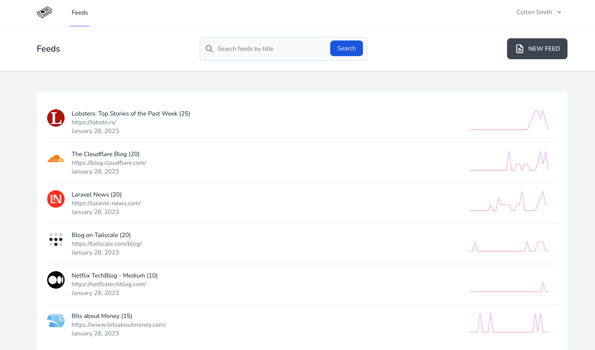
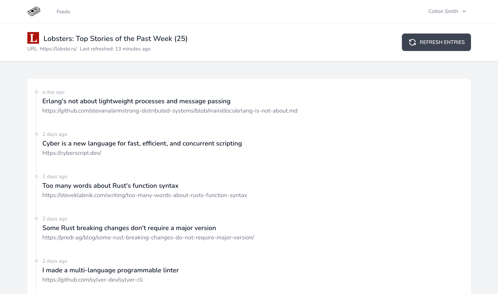
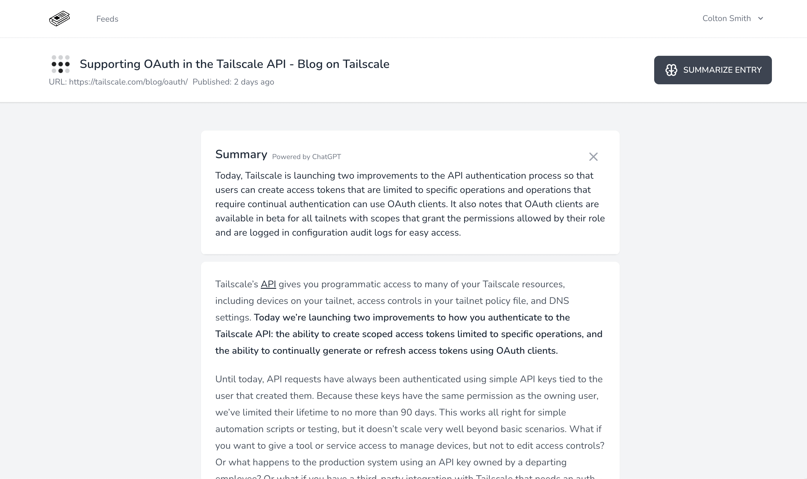

# Larafeed

<!-- badges -->


Larafeed is a simple feed reader.

## Features

- RSS and Atom feed support
- Background feed updates
- Full-text search through a reactive search bar
- AI-generated summary of entries
- Favicon display
- Spotlight-like search
- OPML import

## Technical overview

- Backend build with Laravel 11
  - Architectured around [Actions](https://laravelactions.com/)
- React for the frontend with the amazing [Mantine](https://mantine.dev/) components and hooks
- [Inertia.js](https://inertiajs.com/) that does the magic glue between Laravel and React
- Feed parsing is powered by [SimplePie](https://github.com/simplepie/simplepie)
  - Through [willvincent/feeds](https://github.com/willvincent/feeds)
- Full text search with Laravel Scout
- Summary generation is powered by OpenAI through [echolabsdev/prism](https://github.com/echolabsdev/prism)
- Background jobs are powered by the Laravel scheduler, Laravel queues and Laravel Horizon
- Favicon fetching is powered by [ash-jc-allen/favicon-fetcher](https://github.com/ash-jc-allen/favicon-fetcher)

## Screenshots

### Feed list



### Feed



### Entry



## Development

### Run locally

Larafeed is built with Laravel Sail, so you can run it locally with Docker.

```bash
cp .env.example .env # and adjust the values
composer update
php artisan migrate --seed
npm install
composer dev
```

A [quick login link](https://github.com/spatie/laravel-login-link) is available on the login form, which will create a user and log you in.

## License

Larafeed is licensed under the [MIT license](LICENSE).
