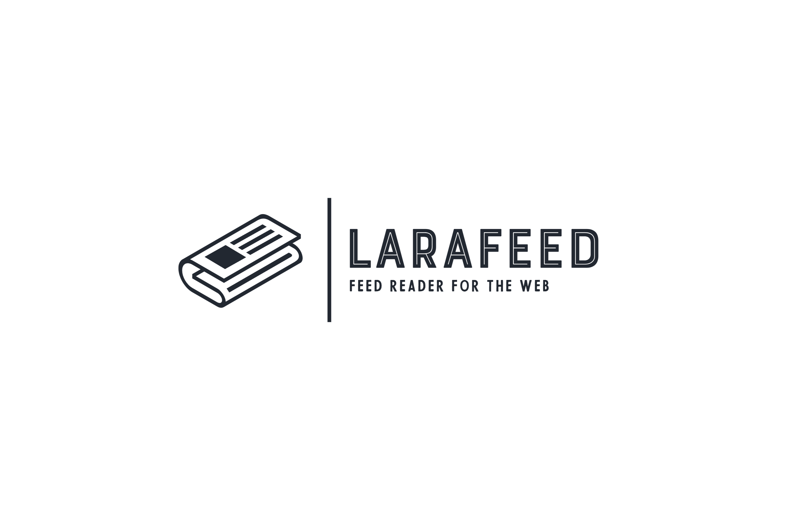
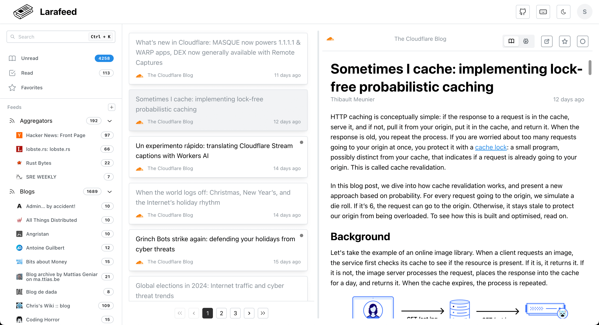
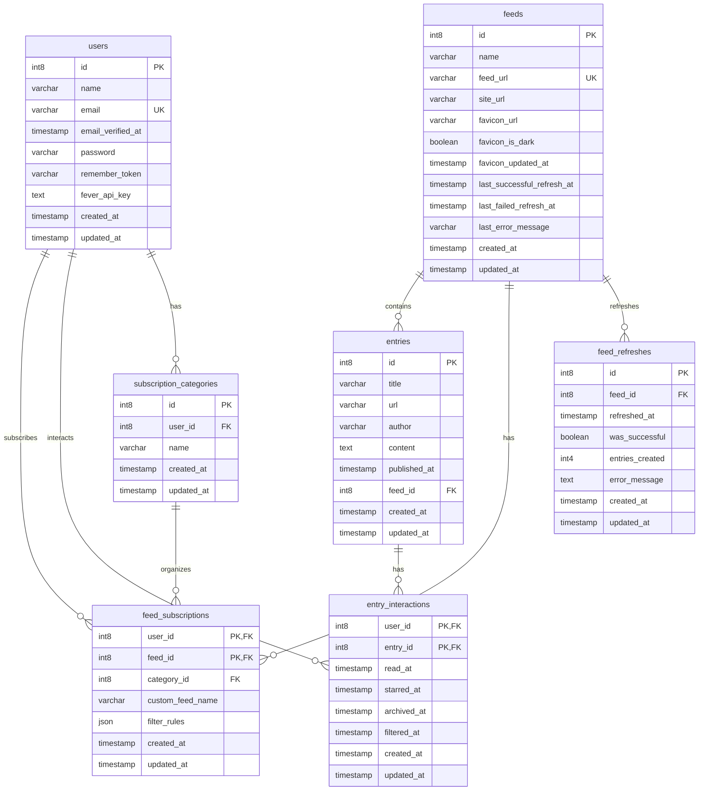

# Larafeed

<!-- badges -->



Larafeed is a simple feed reader.

## Features

- A pleasant and snappy UI
  - Prefetching is leveraged to make the app feel snappy
  - Entry is marked as read when you view it
  - Entry content is modified so that links open in a new tab
- RSS and Atom feed support
- Background feed updates
  - Failures are stored and displayed in the UI
- Custom feed names and categories
- Entry filtering per subscription (hide entries matching patterns by title, content, or author)
- Read and starred entries
- AI-generated summary of entries
- Favicon display (proxified through imgproxy, with automatic dark mode background for dark favicons)
- Spotlight-like go to feed
- OPML import/export
- Support for Google Reader API and Fever API
  - Support is partial, but works with [Reeder classic](https://reederapp.com/classic/) at least
  - Google Reader API is available at `/api/reader` and Fever API at `/api/fever`, both with username+password
- Telegram notifications on user registration and login failures
- Estimated reading time for each entry

### Screenshots & demo

#### Reader view



#### Demo of the LLM summary generation

<https://github.com/user-attachments/assets/0553f893-cc5a-4efa-b098-1b1e10545698>

#### Demo of the feed refreshing UX

<https://github.com/user-attachments/assets/a420f8cd-d306-4a0d-afe3-d391852055ad>

#### Demo of the quick add feed from a bookmark

<https://github.com/user-attachments/assets/bb266745-5d16-4d06-9534-653df38212bc>

## Technical overview

- Backend built with Go
  - [Chi](https://github.com/go-chi/chi) for routing
  - [gonertia](https://github.com/romsar/gonertia) for Inertia.js SSR
  - [pgx](https://github.com/jackc/pgx) for PostgreSQL
  - [sqlc](https://sqlc.dev/) for type-safe SQL queries
  - [River](https://riverqueue.com/) for background jobs (PostgreSQL-backed)
  - [Goose](https://pressly.github.io/goose/) for database migrations
- React for the frontend with the amazing [Mantine](https://mantine.dev/) components and hooks
- [Inertia.js](https://inertiajs.com/) that does the magic glue between the Go backend and React
  - Prefetching is leveraged to make the app feel snappy
- Feed parsing is powered by [gofeed](https://github.com/mmcdole/gofeed)
  - Polite to publishers: uses ETag/Last-Modified headers to avoid re-downloading unchanged feeds
- Summary generation is powered by Gemini
- Favicon fetching and proxification through [imgproxy](https://github.com/imgproxy/imgproxy)
- Images from articles are also proxified and optimized through `imgproxy`, for better privacy and performance
- Google Reader API and Fever API are implemented from scratch
  - I relied heavily on the implementations of [FreshRSS](https://github.com/FreshRSS/FreshRSS/tree/edge/p/api) and [Miniflux](https://github.com/miniflux/v2/tree/main/internal)
  - And in practice, using [Reeder classic](https://reederapp.com/classic/) as a client with Miniflux as a backend, I inspected the API calls with [mitmproxy](https://mitmproxy.org/) to, in a way, _reverse-engineer_ the API

### Database schema


```mermaid
erDiagram
    users {
        int8 id PK
        varchar name
        varchar email UK
        timestamp email_verified_at
        varchar password
        varchar remember_token
        text fever_api_key
        timestamp created_at
        timestamp updated_at
    }

    feeds {
        int8 id PK
        varchar name
        varchar feed_url UK
        varchar site_url
        varchar favicon_url
        boolean favicon_is_dark
        timestamp favicon_updated_at
        timestamp last_successful_refresh_at
        timestamp last_failed_refresh_at
        varchar last_error_message
        timestamp created_at
        timestamp updated_at
    }

    entries {
        int8 id PK
        varchar title
        varchar url
        varchar author
        text content
        timestamp published_at
        int8 feed_id FK
        timestamp created_at
        timestamp updated_at
    }

    feed_refreshes {
        int8 id PK
        int8 feed_id FK
        timestamp refreshed_at
        boolean was_successful
        int4 entries_created
        text error_message
        timestamp created_at
        timestamp updated_at
    }

    feed_subscriptions {
        int8 user_id PK,FK
        int8 feed_id PK,FK
        int8 category_id FK
        varchar custom_feed_name
        json filter_rules
        timestamp created_at
        timestamp updated_at
    }

    subscription_categories {
        int8 id PK
        int8 user_id FK
        varchar name
        timestamp created_at
        timestamp updated_at
    }

    entry_interactions {
        int8 user_id PK,FK
        int8 entry_id PK,FK
        timestamp read_at
        timestamp starred_at
        timestamp archived_at
        timestamp filtered_at
        timestamp created_at
        timestamp updated_at
    }

    users ||--o{ feed_subscriptions : "subscribes"
    users ||--o{ entry_interactions : "interacts"
    users ||--o{ subscription_categories : "has"
    feeds ||--o{ entries : "contains"
    feeds ||--o{ feed_subscriptions : "has"
    feeds ||--o{ feed_refreshes : "refreshes"
    entries ||--o{ entry_interactions : "has"
    subscription_categories ||--o{ feed_subscriptions : "organizes"
```

### Self-hosting

See [docs/self-hosting.md](docs/self-hosting.md) for Docker Compose setup instructions.

## Development

### Run locally

```bash
cp .env.example .env # and adjust the values
npm install
npm run dev          # Vite dev server in another terminal
docker compose -f docker-compose.dev.yml up  # Go backend with hot reload + PostgreSQL
```

## License

Larafeed is licensed under the [MIT license](LICENSE).
