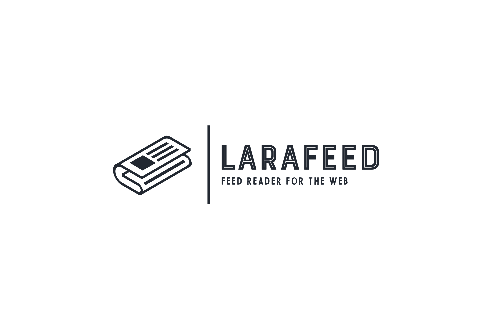
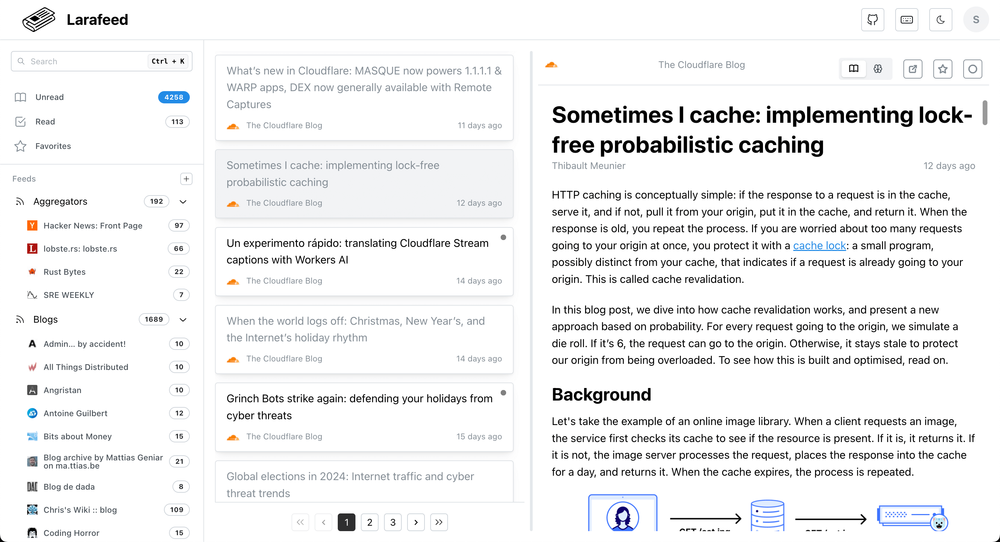
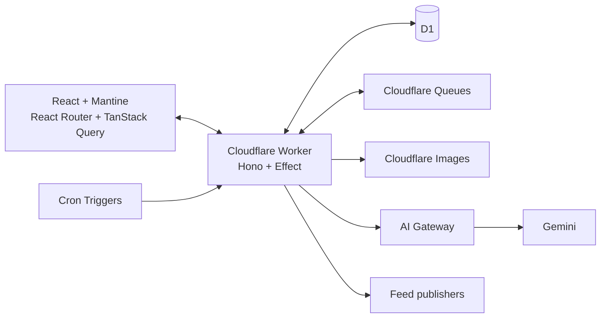

# Larafeed

<!-- badges -->



Larafeed is a simple feed reader.

## Features

- A pleasant and snappy UI
  - Entries are marked as read when you view them
  - Entry links open in a new tab
  - Keyboard shortcuts and quick feed navigation
- RSS, Atom, RDF, and JSON Feed support
- Background feed updates
  - Failures are stored and displayed in the UI
- Custom feed names and categories
- Entry filtering per subscription by title, content, or author
- Read, starred, and archived entries
- AI-generated summaries
- Favicon display with automatic dark-mode styling
- OPML import and export
- Google Reader and Fever API support with revocable app tokens
  - Support is partial, but works with [Reeder Classic](https://reederapp.com/classic/)
- Passkey-only private access
- Estimated reading time for each entry

### Screenshots & demo

#### Reader view



#### Demo of the LLM summary generation

<https://github.com/user-attachments/assets/0553f893-cc5a-4efa-b098-1b1e10545698>

#### Demo of the feed refreshing UX

<https://github.com/user-attachments/assets/a420f8cd-d306-4a0d-afe3-d391852055ad>

#### Demo of the quick add feed from a bookmark

<https://github.com/user-attachments/assets/bb266745-5d16-4d06-9534-653df38212bc>

## Technical overview


```mermaid
flowchart LR
    Browser["React + Mantine<br/>React Router + TanStack Query"]
    Worker["Cloudflare Worker<br/>Hono + Effect"]
    D1[(D1)]
    Queues[Cloudflare Queues]
    Cron[Cron Triggers]
    Images[Cloudflare Images]
    AI[AI Gateway]
    Gemini[Gemini]
    Feeds[Feed publishers]

    Browser <--> Worker
    Worker <--> D1
    Worker <--> Queues
    Cron --> Worker
    Worker --> Images
    Worker --> AI --> Gemini
    Worker --> Feeds
```

- The TypeScript backend runs on [Cloudflare Workers](https://workers.cloudflare.com/) with [Hono](https://hono.dev/) for routing and [Effect](https://effect.website/) for application logic.
- The frontend uses React with the amazing [Mantine](https://mantine.dev/) components and hooks, React Router, and TanStack Query.
- D1 stores users, subscriptions, entries, sessions, and durable job state.
- Queues process feed discovery, refreshes, and favicons one feed at a time.
- Feed requests use conditional HTTP headers to avoid downloading unchanged content, then adapt their next refresh from observed changes and publisher cache hints.
- Cloudflare Images proxies article images for privacy and performance.
- AI summaries use Gemini through Cloudflare AI Gateway and are cached in D1.
- Google Reader and Fever APIs are implemented from scratch.
  - I relied heavily on the implementations in [FreshRSS](https://github.com/FreshRSS/FreshRSS/tree/edge/p/api) and [Miniflux](https://github.com/miniflux/v2/tree/main/internal).
  - Using [Reeder Classic](https://reederapp.com/classic/) with Miniflux as a backend, I inspected the API calls with [mitmproxy](https://mitmproxy.org/) to reverse-engineer the protocols.

## Deploy to Cloudflare

[](https://deploy.workers.cloudflare.com/?url=https://github.com/angristan/larafeed)

The installer provisions the Worker, D1 database, and Queues, then applies all D1 migrations. It asks for the public HTTPS origin and a private operator secret used to create the first administrator enrollment link.

See the [deployment guide](docs/deployment.md) for administrator enrollment and optional integrations. Operational and reader-client details are in the [operations](docs/operations.md) and [compatibility API](docs/compatibility-apis.md) guides.

## Development

Requirements: Node.js 24, npm, and Bun.

```bash
npm ci
npx playwright install chromium
cp .dev.vars.local.example .dev.vars
npm run d1:migrate:local
npm run dev
```

Run the complete validation suite with `npm run validate`.

## License

Larafeed is licensed under the [MIT license](LICENSE).
