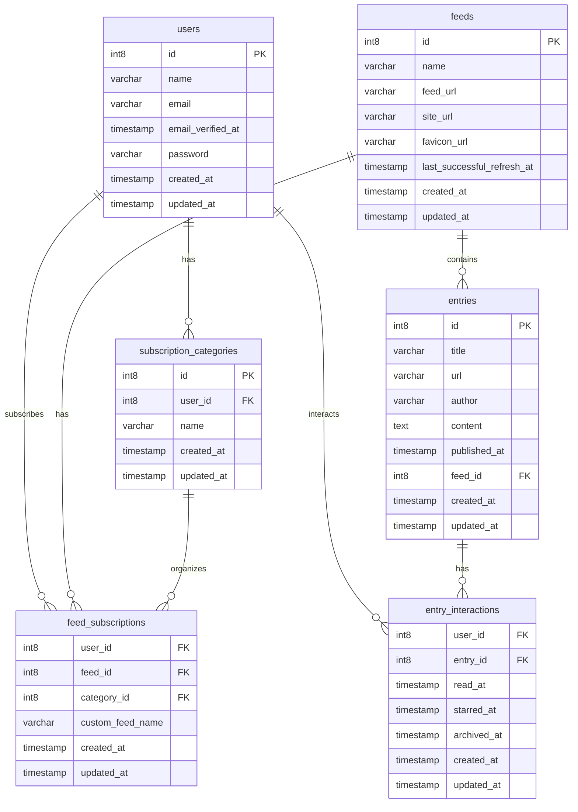

# Larafeed

<!-- badges -->


Larafeed is a simple feed reader.

## Features

- A pleasant and snappy UI
  - Prefetching is leveraged to make the app feel snappy
  - Entry is marked as read when you view it
  - Entry content is modified so that links open in a new tab
- RSS and Atom feed support
- Background feed updates
  - Failures are stored and displayed in the UI
- Custom feed names and categories
- Read and starred entries
- AI-generated summary of entries
- Favicon display (proxified through imgproxy)
- Spotlight-like go to feed
- OPML import/export
- Support for Google Reader API and Fever API
  - Support is partial, but works with [Reeder classic](https://reederapp.com/classic/) at least
  - Google Reader API is available at `/api/reader` and Fever API at `/api/fever`, both with username+password
- Telegram notications on user registration and login failures
- Estimated reading time for each entry

### Screenshots & demo

#### Reader view


#### Demo of the LLM summary generation

<https://github.com/user-attachments/assets/0553f893-cc5a-4efa-b098-1b1e10545698>

#### Demo of the feed refreshing UX

<https://github.com/user-attachments/assets/a420f8cd-d306-4a0d-afe3-d391852055ad>

## Technical overview

- Backend build with Laravel 11
  - Architectured around [Actions](https://laravelactions.com/)
- React for the frontend with the amazing [Mantine](https://mantine.dev/) components and hooks
- [Inertia.js](https://inertiajs.com/) that does the magic glue between Laravel and React
  - Prefetching is leveraged to make the app feel snappy
- Feed parsing is powered by [SimplePie](https://github.com/simplepie/simplepie)
  - Through [willvincent/feeds](https://github.com/willvincent/feeds)
- Summary generation is powered by Gemini through [echolabsdev/prism](https://github.com/echolabsdev/prism)
- Background jobs are powered by Laravel queues
- Favicon fetching is powered by [ash-jc-allen/favicon-fetcher](https://github.com/ash-jc-allen/favicon-fetcher)
  - They are proxified through [imgproxy](https://github.com/imgproxy/imgproxy)
- Google Reader API and Fever API are implemented from scratch
  - I relied heavily on the implementations of [FreshRSS](https://github.com/FreshRSS/FreshRSS/tree/edge/p/api) and [Miniflux](https://github.com/miniflux/v2/tree/main/internal)
  - And in practice, using [Reeder classic](https://reederapp.com/classic/) as a client with Miniflux as a backend, I inspected the API calls with [mitmproxy](https://mitmproxy.org/) to, in a way, *reverse-engineer* the API

### Database schema



### Deployment

The project is currently deployed on [Railway](https://railway.com?referralCode=XPWq2Z):


The web server is powered by Laravel Octane, FrankenPHP and Caddy. ⚡️

#### Docker-compose

You can run Larafeed for yourself with Docker Compose. The `docker-compose.yml` file is provided in the repository. By default it will use the Docker image from the GitHub Container Registry that is built on every push.

Make sure to update the `.env.compose` file with your own values.

- For `APP_KEY`:
  - `docker-compose exec -it queue bash -c "php artisan key:generate --show"`
- For `IMGPRPOXY_SALT` and `IMGPROXY_KEY`:
  - `echo $(xxd -g 2 -l 64 -p /dev/random | tr -d '\n')`

## Development

### Run locally

Larafeed is built with Laravel Sail, so you can run it locally with Docker.

```bash
cp .env.example .env # and adjust the values
composer update
php artisan migrate --seed
npm install
composer dev
```

A [quick login link](https://github.com/spatie/laravel-login-link) is available on the login form, which will create a user and log you in.

## License

Larafeed is licensed under the [MIT license](LICENSE).
